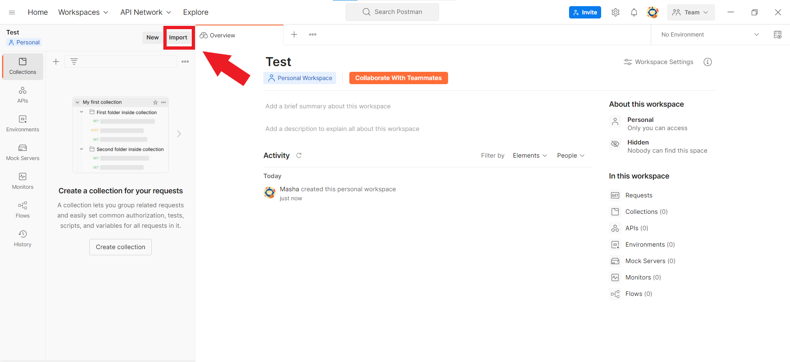
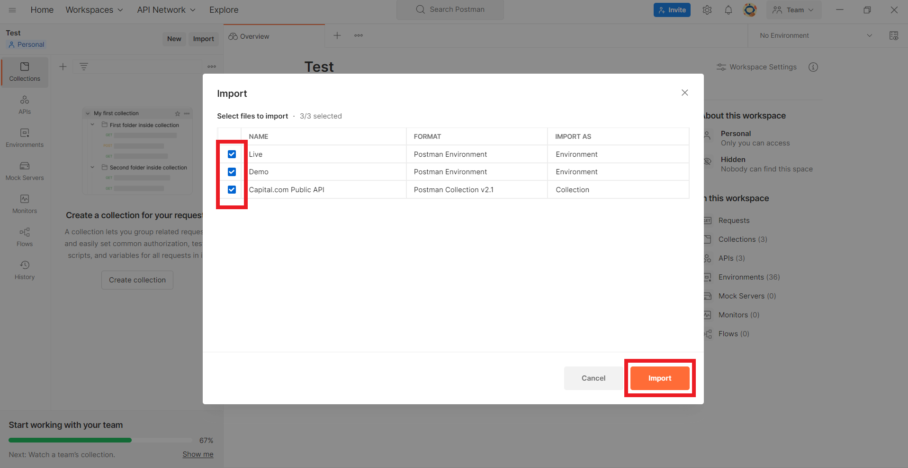
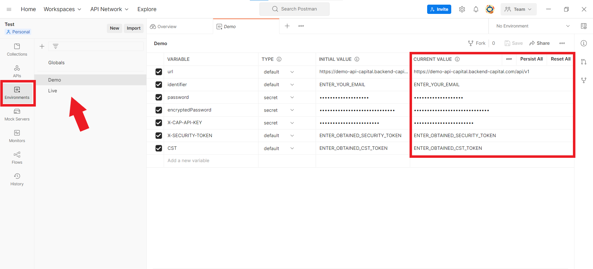
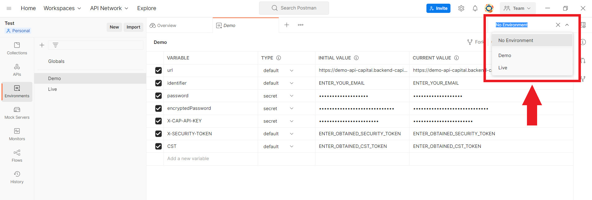

# Capital.com Public API - Postman Collection

Capital.com is happy to share with you a ready-to-use Postman collection with all available REST API methods. To use the collection simply import it and mention your own account credentials.

Here you can find Postman collection of Capital.com Public API and files for Live and Demo environments

- `capital.collection.json` - General Postman collection
- `demo.environment.json` - Config for Demo environment
- `live.environment.json` - Config for Live environment

### How to start using the collection
1. Download the repository to your computer;
2. Go to Postman and click on the `Import` button. It can be found in the left upper corner either under the File line or just as a stand-alone button;
   
3. You will see a popup saying Import. Please, stay on the File tab there and click on the `Upload Files` button;
   
4. Then select the particular collections and environments you need and click on the `Import` button in the right down corner;
   
5. To set the account credentials please click on the `Environment` tab on the left vertical bar, choose the needed environment and set your own values in the - `Current Value` column. It is essential to set identifier, `password` / `encryptedPassword` and `X-CAP-API-KEY` parameters values there;
   
6. Select a freshly set environment in the upper right corner of the Postman tool.
   

### Credential values in variables of the selected environment:
- `identifier` - platform login
- `password` - platform password
- `X-CAP-API-KEY` - the received in the platform’s Settings API key

## Postman safety notes
- Don’t import collections from the unknown sources;
- Review the imported collection before usage;
- Don’t use pieces of code that you don’t understand;
- Delete your account credentials from the environment settings as soon as you decide not to use the collection anymore.

## Useful links
- [Capital.com website API documentation](https://capital.com/api)
- [Capital.com API Specification](https://open-api.capital.com/)
- [Capital.com API FAQ](https://capital.zendesk.com/hc/en-us/sections/4415178206354-API)
- [Postman - Importing data into Postman](https://learning.postman.com/docs/getting-started/importing-and-exporting-data/#importing-data-into-postman)
- [Postman - Managing environments](https://learning.postman.com/docs/sending-requests/managing-environments/)

## License
See the [LICENSE](LICENSE.md) file for license rights and limitations (MIT).

